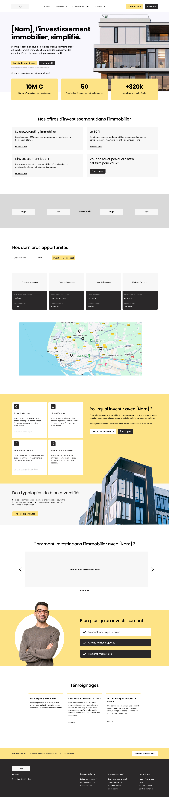
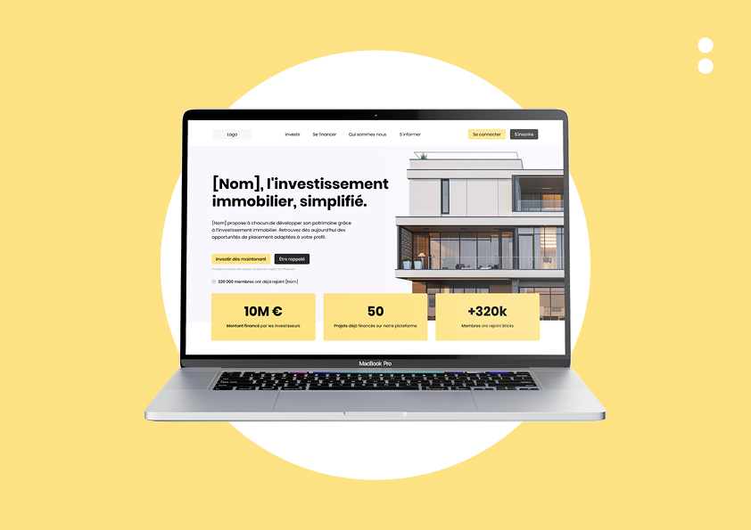
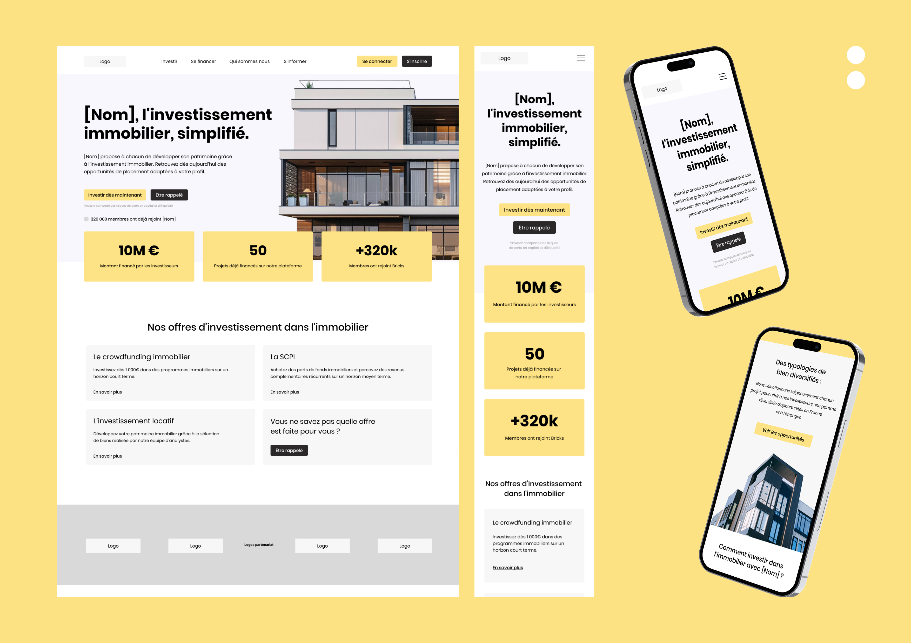
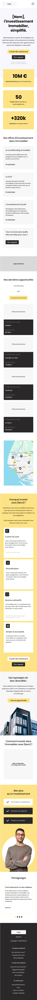

# Plateforme d'investissement immobilier - Maquette UI/UX

Ce projet est une proposition de maquette pour une plateforme d'investissement immobilier. L'objectif était de simplifier l'accès à l'investissement immobilier pour les particuliers via différentes offres comme le crowdfunding, la SCPI et l'investissement locatif.

Note : Il ne s'agit que d'un travail de conception UI/UX. Aucun développement frontend ou backend n’a été réalisé. Le projet n’a pas abouti avec le client.

## Présentation

La maquette présente plusieurs écrans clés :

- Page d'accueil (version desktop et mobile)
- Page de connexion
- Mockups de présentation (laptop et mobile)

Tous les visuels sont disponibles dans le dossier `/screenshots`.

### Aperçus

#### Page d'accueil (desktop)

#### Page de connexion

#### Mockup Laptop

#### Mockup Mobile

#### Page d'accueil mobile

## Fonctionnalités représentées

- Aperçu des offres d'investissement immobilier
- Filtrage des opportunités par type d'investissement
- Mise en avant des avantages de la plateforme
- Témoignages clients
- Interface de connexion

## Outils utilisés

- Figma – pour la conception de l’interface
- Photoshop / Illustrator (optionnel) – pour les retouches et la présentation

## Auteur

Projet réalisé par Martial Mertzig  
Freelance Développeur Full Stack

## Droits d’auteur

Ce projet est une création originale de Martial Mertzig. Toute reproduction, réutilisation ou diffusion des éléments graphiques sans autorisation préalable est interdite.  
Les visuels présentés ont été conçus dans le cadre d’une mission freelance non finalisée.